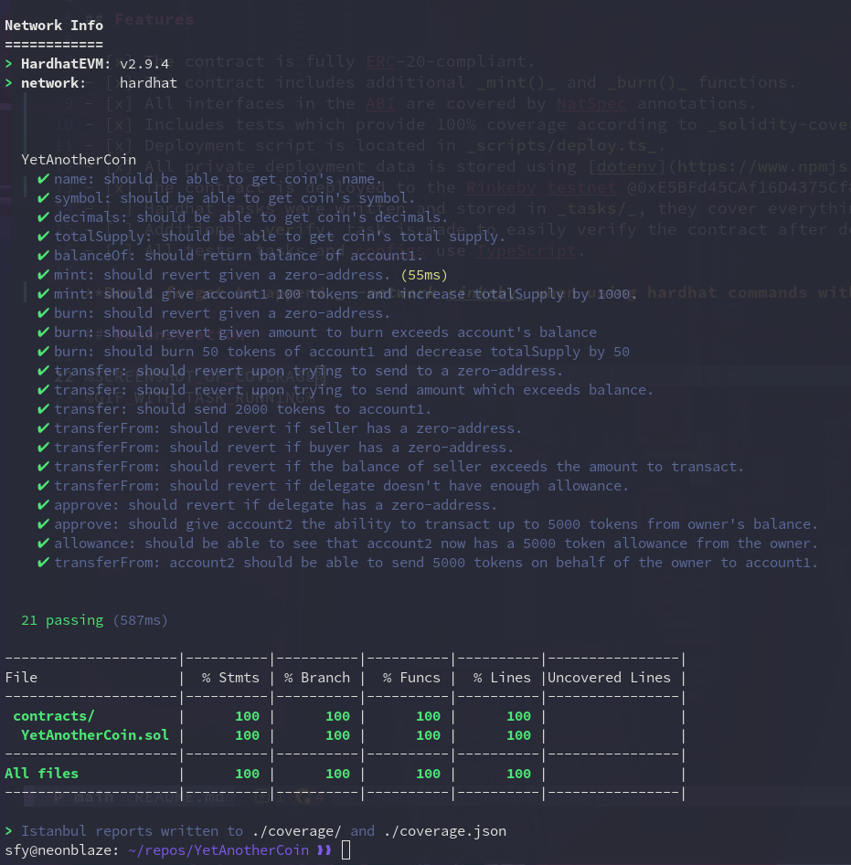
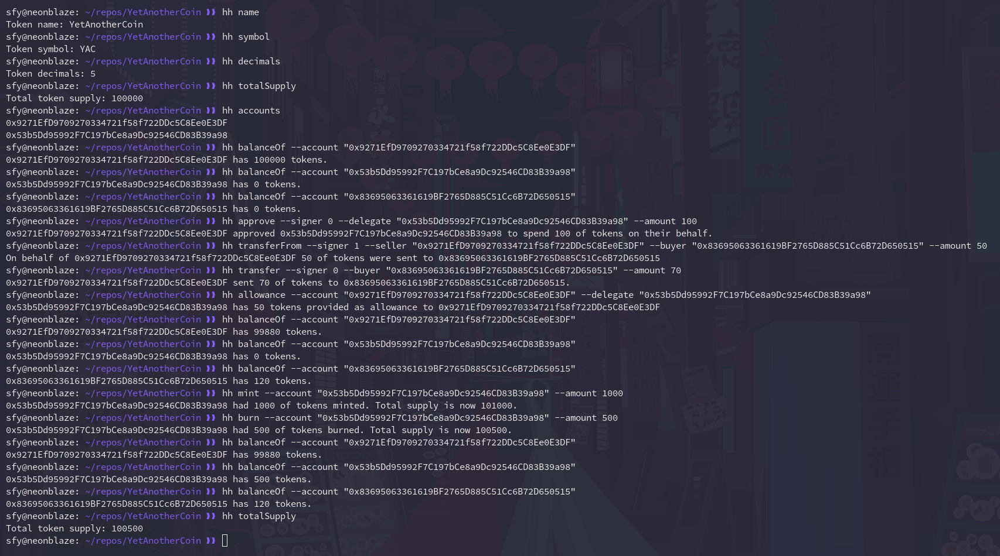
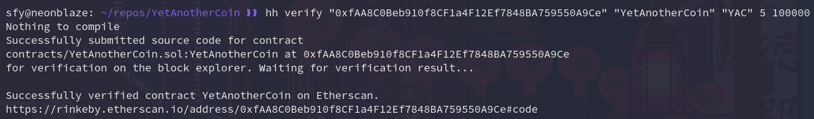

# YetAnotherCoin 💰

A simple ERC-20-compliant token I made to better understand the [ERC-20 standard](https://eips.ethereum.org/EIPS/eip-20).

## Features

- [x] The contract is fully ERC-20-compliant.
- [x] The contract includes additional _mint()_ and _burn()_ functions.
- [x] All interfaces in the ABI are covered by NatSpec annotations.
- [x] Includes tests which provide 100% coverage according to _solidity-coverage_ in _test/yet-another-coin-test.ts_.
- [x] Deployment script is located in _scripts/deploy.ts_.
- [x] All private deployment data is stored using [dotenv](https://www.npmjs.com/package/dotenv).
- [x] The contract is deployed to the Rinkeby testnet @0xB89F9f4Da44E29D8A60dC97038E220E3f7642C42.
- [x] Hardhat tasks were written and stored in _tasks/_, they cover everything in the ABI.
- [x] Additional _verify_ task is made to easily verify the contract after deployment.
- [x] Verified contract is available on [Etherscan](https://rinkeby.etherscan.io/address/0xB89F9f4Da44E29D8A60dC97038E220E3f7642C42#code).
- [x] All tests, tasks and configs use TypeScript.

**Default network is set to Rinkeby in the hardhat config.**

## Update (2022-05-19)

Optimized the contract in several ways:

- [x] public → external for all functions except mint() @a67daf3
- [x] add "unchecked" optimizations @c61085d
- [x] import index.ts instead of multiple tasks @1dc52f4
- [x] use implicit getters where possible @4d77365
- [x] don't statically assign values in constructor @1689d73
- [x] use mint() to assign totalSupply to owner in constructor @67d5ef8
- [x] address of the deployed contract is now stored in config.ts @9d94291
- [x] contract is no longer Ownable, removed onlyOwner @f91ed2b

## Update (2022-05-22)

Optimized the contract in several ways:

- [x] Made the interface IYetAnotherCoin as it makes the code more modular and extensible.
- [x] Moved all NatSpec to the interface.
- [x] Made a helper \_transfer() function to make the code less repetitive.
- [x] Made a helper \_spendAllowance() function to handle require() in transferFrom().
- [x] Updated tests.
- [x] Compiler version up (0.8.4 → 0.8.8) because: ```Starting from Solidity 0.8.8, the override keyword is not required when overriding an interface function, except for the case where the function is defined in multiple bases.```
- [x] Re-verified the new contract and updated README.

## Demonstration






